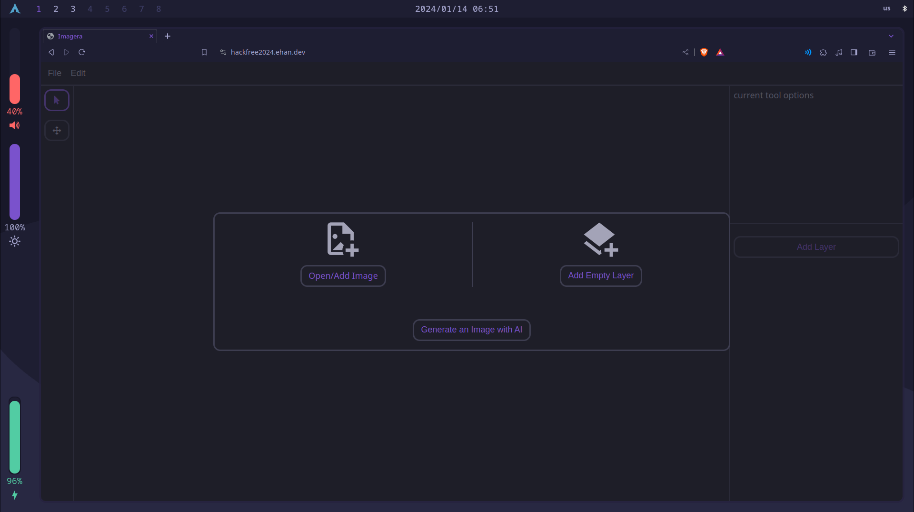
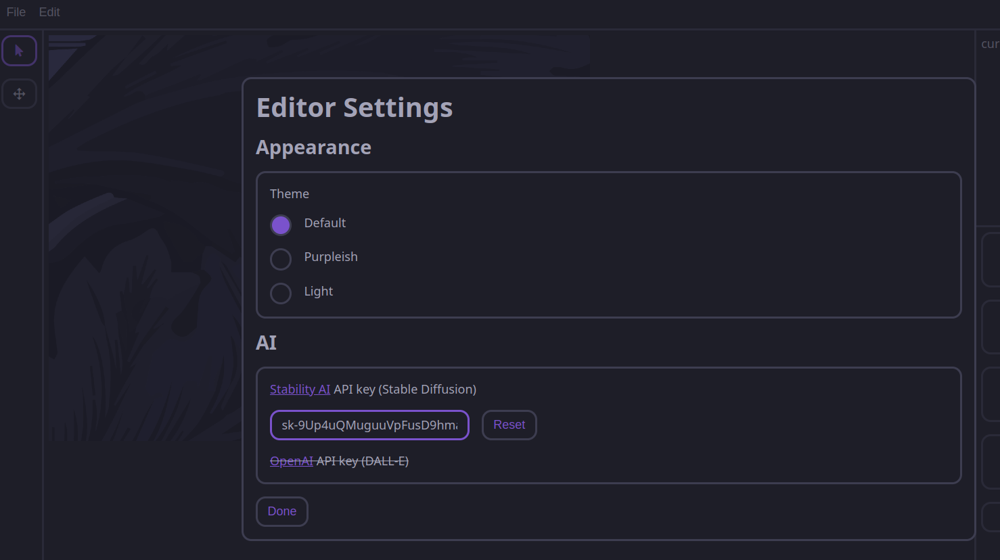

# Imagera

HackFRee 2024 Project

Team ERA (Ehan Ahamed, Rishi Sire, & Alen Sultan) 

Imagera is an accessible & easy-to-use AI powered image editor.

https://hackfree2024.ehan.dev/

## Introduction

Most image editing and AI-powered software don't run on ordinary computers, mobile devices, or chromebooks. This makes these new tools inaccessible to the wider public, which hinders the potential for widespread use of these innovative technologies. The goal of Imagera is to make AI-enhanced photo editing and graphic design more accessible and easier to use, which empowers users to unleash their creativity without the limitations of traditional image editing and AI.

## Overview

Imagera is an open source image editor that runs on the web. That means it works on many different platforms, regardless of what operating system or hardware is available.

## Development

The entire project, except for the icon library and stable diffusion api were made by us during the time of the hackathon. Imagera is written in plain JavaScript (with HTML & CSS), with no framework or UI library. The actual image manipulation uses HTML Canvas.

## Screenshots

